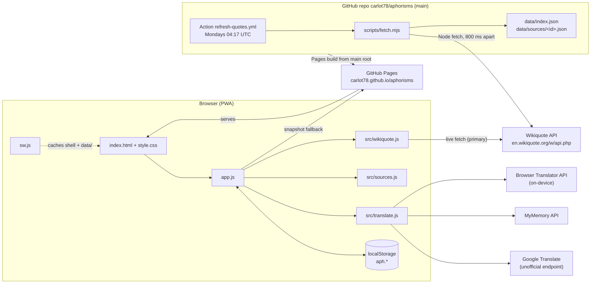

# Aphorisms — Requirements & Architecture

## 1. Overview

Aphorisms is a static, no-build Progressive Web App (plain HTML/CSS/JS, ES modules) that shows one thought a day — a sentence, aphorism or short paragraph — drawn from the personal-development sources the user ticks in a catalog of 79 authors and books. The text is retrieved autonomously from the English Wikiquote `parse` API, parsed in the browser, cached in `localStorage`, and optionally shown alongside a machine translation into one of 24 languages. It is built for a single person (no accounts, no backend) and runs on any modern browser or as an installed home-screen app. Live app: https://carlot78.github.io/aphorisms/ — repository: https://github.com/carlot78/aphorisms (MIT code, CC BY-SA 4.0 quote text).

## 2. Requirements

### 2.1 Functional requirements

The three original owner requirements are:

- **R1** — "I want to have an app to present daily to the user a sentence, aphorism, or paragraph from a selection of personal development sources selected by the user, to allow him continuously to refresh that."
- **R2** — "the app should retrieve the sentences autonomously"
- **R3** — "Add the possibility to have the sentence translated in a language of choice (but keeping the one in english)"

| ID | Requirement | Traces to | Implemented in |
| --- | --- | --- | --- |
| FR-1 | Show exactly one quote per calendar day; the pick is held for the whole day (`aph.today` keyed by `todayKey()`, `YYYY-MM-DD` in local time). | R1 | `showToday` in `app.js` |
| FR-2 | The user selects sources from a curated catalog grouped into 8 groups (`GROUPS`); a starter set (`STARTER_IDS`: Marcus Aurelius, Seneca, Epictetus, Laozi, The Buddha, Emerson, Thoreau) is enabled on first launch. Groups offer "all" / "none" toggles. | R1 | `src/sources.js`, `renderSources` |
| FR-3 | Quotes are fetched autonomously from Wikiquote with no user-maintained quote list; each source is re-fetched after `FRESH_MS` (7 days). | R2 | `ensureSources`, `refreshSource`, `src/wikiquote.js` |
| FR-4 | "Another" replaces today's pick with a different one (`showToday({ replace: true })`, seeded with `Date.now()`). | R1 ("continuously refresh") | `el.another` handler |
| FR-5 | No quote repeats until every quote of the enabled pool has been shown (`aph.seen`), after which the seen list is cleared automatically. | R1 | `pickQuote`, `markSeen` |
| FR-6 | Every enabled source has an equal chance of supplying the day's quote regardless of how many quotes it holds (bucket-per-source selection). | R1 | `pool`, `pickQuote` |
| FR-7 | Favourites: save/unsave the current quote (`☆ Save` / `★ Saved`), list and remove favourites. | implemented behaviour | `el.fav`, `renderLists` |
| FR-8 | Past-days history: the last `MAX_HISTORY` (90) daily picks are listed (today excluded). | implemented behaviour | `recordHistory`, `renderLists` |
| FR-9 | Copy the quote to the clipboard as `“text” — Source`, followed by the cached translation when one exists. | implemented behaviour | `el.copy` handler |
| FR-10 | Add any Wikiquote page by title as a custom source (`customSource(title)`, id `custom:<slug>`); the page is looked up live before being added; custom sources can be removed. | R1, R2 | `el.addCustom` handler |
| FR-11 | "My own lines": free-text, one thought per line (lines longer than 3 characters), participate in the daily pick as source `own`. | R1 | `ownSource` |
| FR-12 | Optional translation into one of `LANGUAGES` (24 codes); the English original is always displayed, the translation rendered under it in `#quote-translation` with a `lang` attribute. Selecting "No translation" (`''`) hides it. | R3 | `renderTranslation`, `src/translate.js` |
| FR-13 | Data actions: "Refresh from Wikiquote now" (`ensureSources({ force: true })`), "Forget what I've seen" (clears `aph.seen`), "Reset everything" (removes every `aph.*` key after `confirm()` and reloads). | implemented behaviour | `el.refreshAll`, `el.resetSeen`, `el.resetAll` |
| FR-14 | New-day detection while the tab stays open: on `visibilitychange` to `visible`, if `aph.today.date !== todayKey()` the date label and quote are refreshed. | R1 | `bind()` |
| FR-15 | If today's quote comes from a source that was just disabled (or own lines were emptied), a new quote is picked when the settings dialog closes. | R1 | dialog `close` handler |
| FR-16 | The quote card links the source name to the Wikiquote page URL and shows section path and citation (`section · cite`). | R2 (attribution) | `renderQuote` |
| FR-17 | Progress and error feedback via a live-region status line (`Fetching X… (n/m)`, `Couldn't load: …`, `Copied.`, `Storage is full — …`). | implemented behaviour | `setStatus` |

### 2.2 Non-functional requirements

| ID | Requirement | Evidence |
| --- | --- | --- |
| NFR-1 | **Static hosting, no backend.** Everything runs in the browser; the only server is GitHub Pages serving files. | `index.html` loads `app.js` as a module; no server code exists. |
| NFR-2 | **No accounts, no tracking.** No sign-in, no analytics, no third-party scripts. | `index.html` contains no external script or tracker. |
| NFR-3 | **Privacy: all state in `localStorage`** under the `aph.` prefix (selection, caches, history, favourites, own lines, translations). Own lines and settings never leave the device; quote text goes to translation providers only when the user picks a language. | `store` object in `app.js`. |
| NFR-4 | **Offline capable.** App shell precached by a service worker; quote data already in `localStorage`; on-device translation works offline once a language pack is installed. | `sw.js`, `viaBuiltin`. |
| NFR-5 | **No build step, no dependencies.** Plain ES modules; no `package.json`; the Node script imports only `node:` built-ins and the shared `src/` modules. | `README.md` "Run locally"; `scripts/fetch.mjs` imports. |
| NFR-6 | **Politeness to Wikiquote.** Browser fetches at most `CONCURRENCY = 3` sources at a time and only when stale; the Action fetches serially with `DELAY_MS = 800` between requests and a descriptive `User-Agent`; the snapshot absorbs traffic when Wikiquote is unreachable or rate-limiting. | `ensureSources`, `scripts/fetch.mjs`. |
| NFR-7 | **Licensing.** Code MIT (`LICENSE`, © 2026 Carlo Tuzi); quote text CC BY-SA 4.0, credited in the page footer with a link to Wikiquote. | `LICENSE`, `index.html` footer. |
| NFR-8 | **Mobile-friendly and installable.** `viewport-fit=cover`, safe-area padding, `100dvh`, light/dark via `prefers-color-scheme`, `manifest.webmanifest` with `display: standalone`, SVG maskable icon. | `style.css`, `manifest.webmanifest`. |
| NFR-9 | **Bounded storage.** Per-source cap `MAX_QUOTES_PER_SOURCE = 400` (evenly sampled), `MAX_SEEN = 3000`, `MAX_HISTORY = 90`, `MAX_TRANSLATIONS = 300`; quota errors surface as a status message rather than a crash. | `sample`, `markSeen`, `recordHistory`, `rememberTranslation`, `store.set`. |
| NFR-10 | **Deterministic daily pick per device.** Same date + same `salt` → same quote, so reloads do not change the thought of the day. | `mulberry32(parseInt(hash(date + salt), 16))`. |

### 2.3 Out of scope / known limitations

- **No cross-device sync.** State is per browser profile; there is no export/import.
- **No push notifications or reminders.** The app only updates when opened or when the tab becomes visible.
- **Wikiquote coverage of modern, copyrighted authors is thin.** Catalog entries such as James Clear or Brené Brown may yield few quotes; the equal-chance picking keeps them from being drowned out but cannot create content.
- **MyMemory quota.** Anonymous use is limited (~5000 chars/day per the comment in `src/translate.js`); once `quotaFinished` is returned the chain falls through to Google.
- **Google Translate endpoint is unofficial.** `translate.googleapis.com/translate_a/single?client=gtx` is undocumented and may break or be blocked without notice.
- **Dependency on Wikiquote's page structure.** The parser relies on `<h2>…<h6>` headings and top-level `<ul>/<ol>` `<li>` items with nested citation lists; a MediaWiki skin/markup change can silently reduce the quote yield to zero (the app then falls back to the snapshot).
- **Built-in Translator API availability.** Only Chromium 138+ with a downloaded language pack; other browsers skip straight to network providers.
- **Language heuristics.** `looksEnglish` is a stopword heuristic; short or unusual English lines can be dropped, and non-English text with many English function words can slip through.
- **Storage limit.** `localStorage` (~5 MB) caps how many sources can be enabled at once; the app reports "Storage is full" rather than paging.

## 3. Architecture

### 3.1 High-level view



### 3.2 Components

#### `index.html`
Single page. Header (brand, date, sources button), the quote card (`#quote-text`, `#quote-translation`, source link, citation), an empty-state section, action buttons (`#another`, `#copy`, `#fav`), a `<details>` drawer for favourites and past days, a live-region `#status`, and a native `<dialog id="sources-dialog">` holding: source groups, custom page input, translation `<select id="lang">`, own-lines `<textarea>`, and the three data buttons. Loads `app.js` as `type="module"`, links `manifest.webmanifest` and `icon.svg`.

#### `style.css`
CSS custom properties for a warm light theme, overridden under `@media (prefers-color-scheme: dark)`. Serif face for quote text and translation; `clamp()` type scale, `.quote.long` for texts over 280 characters; `.translation` styled italic with a dashed top rule, `.pending` dims it while loading; chip-style checkboxes (`.chip:has(input:checked)`); mobile tweaks below 600 px.

#### `app.js` (entry point)
Owns UI state, persistence, source loading and picking. Key functions: `store` (`get`/`set`/`remove`/`keys`, all keys prefixed `aph.`), `todayKey`, `mulberry32`, `loadCached`, `sample`, `storeSource`, `fetchSnapshot`, `refreshSource`, `ownSource`, `ensureSources`, `pool`, `pickQuote`, `markSeen`, `recordHistory`, `showToday`, `renderQuote`, `renderTranslation`, `cachedTranslation`, `rememberTranslation`, `renderLanguageSelect`, `renderLists`, `renderSources`, `renderDataStatus`, `setEnabled`, `bind`, `init`. Constants: `FRESH_MS`, `SNAPSHOT_RETRY_MS`, `MAX_QUOTES_PER_SOURCE`, `MAX_SEEN`, `MAX_HISTORY`, `CONCURRENCY`, `OWN_ID = 'own'`, `MAX_TRANSLATIONS`.

#### `src/wikiquote.js` (shared browser/Node)
Exports `API`, `apiUrl(title)`, `fetchSource(title, { fetchImpl, headers })`, `extractQuotes(html, sourceTitle)`, `looksEnglish(text)`, `toText(html)`, `hash(str)`. Internal: `listItems`, `splitItem`, `pickText`, `cleanQuote`, `EXCLUDED_HEADING`, `MIN_LEN = 30`, `MAX_LEN = 700`, `ENGLISH_WORDS`, `ENTITIES`. No DOM, no dependencies; `fetchImpl` defaults to `globalThis.fetch`.

#### `src/sources.js`
Exports `GROUPS` (8 names), `SOURCES` (79 entries `{ id, title, name, group, blurb, starter? }` where `title` is the exact Wikiquote page title), `STARTER_IDS`, `sourceById(id)`, `customSource(title)` (returns `{ id: 'custom:<slug>', title, name, group: 'Custom', blurb: 'Wikiquote page', custom: true }`).

#### `src/translate.js`
Exports `LANGUAGES` (24 BCP-47 codes), `languageName(code, locale)` (via `Intl.DisplayNames`, falls back to the code), `chunk(text, max)`, `translate(text, lang)`. Internal providers `viaBuiltin`, `viaMyMemory`, `viaGoogle` in `PROVIDERS` order; helpers `withTimeout`, `timeout`, `MYMEMORY_MAX = 450`.

#### `scripts/fetch.mjs`
Node 22 script (no dependencies). Imports `SOURCES` and `fetchSource`, iterates the catalog (or the ids given on the command line), writes `data/sources/<id>.json` and updates `data/index.json`. Sends `User-Agent: aphorisms-bot/1.0 (https://github.com/carlot78/aphorisms)` and sleeps `DELAY_MS = 800` between pages. Exits 1 only if every target failed.

#### `.github/workflows/refresh-quotes.yml`
Scheduled GitHub Action that runs the fetch script and commits the snapshot (see 3.9).

#### `sw.js`
Service worker: precaches the `SHELL` list under cache `VERSION = 'aphorisms-v3'`, deletes older caches on activate, serves same-origin GET requests stale-while-revalidate (see 3.8).

#### `manifest.webmanifest`
PWA manifest: `name`/`short_name` "Aphorisms", `start_url` and `scope` `./`, `display: standalone`, background/theme `#f6f1e7`, single SVG icon `any maskable`.

#### `data/`
Generated snapshot. `data/index.json` has the shape `{ "generated": ISO, "sources": { "<id>": { "title", "count", "fetchedAt" } } }`. Each `data/sources/<id>.json` is `{ id, title, url, fetchedAt, quotes: [ { id, text, source, section, cite } ] }` — the same quote shape the browser parser produces, uncapped (the browser applies the 400 cap on load).

#### Boot sequence (`init` in `app.js`)

1. Render the date label (`formatDate()`: weekday, day, month in the viewer's locale) and bind all event handlers.
2. `showToday()` — instant if `aph.today` is current or any `aph.src.*` cache exists.
3. `renderLists()` — favourites and history from `localStorage`.
4. `await ensureSources({ onLoaded })` — background refresh; the first loaded source triggers `showToday()` if nothing is on screen yet.
5. `showToday()` again if still empty, then register `sw.js` (skipped on `file:`).

#### Quote object

Every quote, whether parsed live, loaded from the snapshot, or typed as an own line, has the same shape:

| Field | Type | Origin |
| --- | --- | --- |
| `id` | 8-char hex string | `hash(`${sourceTitle}|${normalisedText}`)`; own lines use `hash('own|' + text)` |
| `text` | string | Cleaned quote text (30–700 chars for Wikiquote; > 3 chars for own lines) |
| `source` | string | Wikiquote page title, or `'My own lines'` |
| `section` | string | Heading path below the top-level heading, joined with ` › ` (may be empty) |
| `cite` | string | Citation extracted from the nested list (may be empty) |
| `sourceId` | string | Catalog/custom id or `'own'`; added by `storeSource`/`ownSource` in the browser, absent in `data/sources/*.json` |

### 3.3 Data flow: loading sources

`ensureSources({ force, onLoaded })` is called on boot, when the settings dialog closes, and (with `force: true`) from "Refresh from Wikiquote now".

1. `wanted = settings.enabled.map(findSource).filter(Boolean)` — ids that no longer resolve (e.g. a removed custom) are ignored. `findSource` special-cases `OWN_ID`.
2. A source enters the fetch `queue` when `force` is set, or it has no cache, or its cache age exceeds its freshness window:
   - `origin === 'live'` → `FRESH_MS` = 7 days,
   - `origin === 'snapshot'` → `SNAPSHOT_RETRY_MS` = 24 hours (snapshot-backed sources retry the live fetch daily so a transient Wikiquote outage does not pin them to old data for a week).
3. If the queue is empty the function returns `{ failed: [] }` immediately (so a warm cache costs no network).
4. `CONCURRENCY = 3` worker loops `shift()` from the shared queue. Each worker calls `refreshSource(src)`, reports progress via `setStatus('Fetching <name>… (n/m)')`, and invokes `onLoaded(src)` after a success — `init` and the dialog handler pass `() => { if (!current) showToday(); }` so the first source to land renders a quote immediately.
5. `refreshSource(src)`:
   - tries `fetchSource(src.title)` (live API); an empty parse (`!page.quotes.length`) counts as failure;
   - on failure, if `src.custom` the error is rethrown (custom pages have no snapshot); otherwise `fetchSnapshot(id)` GETs `data/sources/<id>.json` with `cache: 'no-cache'` and stores it with `origin: 'snapshot'`.
   - `storeSource` applies `sample(quotes, MAX_QUOTES_PER_SOURCE)` (evenly spaced picks across the list, not the first N), tags every quote with `sourceId`, stamps `fetchedAt = Date.now()`, writes to the in-memory `sourceCache` Map and to `aph.src.<id>`.
6. A source is added to `failed` only if it had no cache before (`hadCache`); a stale cache that fails to refresh silently keeps serving.
7. Finally the status line lists any failures and `renderDataStatus()` updates the "N sources cached · M quotes · last fetched …" line in the dialog.

Adding a custom source (`el.addCustom`) calls `refreshSource` directly, so the page is validated on Wikiquote before it is appended to `settings.customs` and enabled; the returned `page.title` (after redirects) becomes the display name.

### 3.4 Data flow: choosing the daily quote

`showToday({ replace })`:

1. `date = todayKey()`; if `!replace` and `aph.today.date === date` with a stored quote, that quote is reused unchanged — the day's pick is stable across reloads.
2. Otherwise a seed string is built: `date + settings.salt + (replace ? Date.now() : '')`. `settings.salt` is a random string generated once per browser (`Math.random().toString(36).slice(2)`), so two users with identical selections get different quotes on the same day. The seed is hashed with FNV-1a (`hash`) and parsed as a 32-bit hex integer to seed `mulberry32`, a small deterministic PRNG.
3. `pickQuote(rng)`:
   - `pool()` returns one bucket (array of quotes) per enabled source that has a cache, plus the own-lines bucket if any.
   - Quotes whose `id` is in `aph.seen` are filtered out per bucket; empty buckets are dropped.
   - If nothing unseen remains, `aph.seen` is reset to `[]` and all buckets are used again (everything has been shown once).
   - A bucket is chosen uniformly (`rng() * unseen.length`), then a quote uniformly within it — equal chance per source, independent of bucket size.
4. On success: `current = quote`, `markSeen(quote)` (appends the id, trimming the oldest beyond `MAX_SEEN`), `aph.today = { date, quote }`, `recordHistory(date, quote)` (replaces any entry for the same date, newest first, capped at `MAX_HISTORY`).
5. `renderQuote(current)` (which also triggers `renderTranslation`) and `renderLists()`.

If `pickQuote` returns `null` (nothing cached yet), the empty state shows either "Pick a few sources to begin." or "Nothing loaded yet — check your connection or pick other sources." depending on whether anything is enabled.

### 3.5 Wikiquote parsing

`fetchSource(title)` calls `https://en.wikiquote.org/w/api.php?action=parse&page=<title>&prop=text&format=json&formatversion=2&disabletoc=1&redirects=1&origin=*` (`origin=*` enables anonymous CORS). It throws on non-2xx or on `json.error`, and returns `{ title, pageid, url, quotes }` where `url` is `https://en.wikiquote.org/wiki/<Title_with_underscores>` and `quotes = extractQuotes(json.parse.text, title)`.

**Page structure relied upon** (verified against en.wikiquote.org, per the module header):

```html
<div class="mw-heading mw-heading2"><h2>Quotes</h2>…</div>
<ul><li>Quote text
  <ul><li>citation</li></ul>
</li></ul>
```

`extractQuotes` walks the HTML with a regex tokenizer rather than a DOM:

- `headingRe = /<h([2-6])\b[^>]*>([\s\S]*?)<\/h\1>/gi` splits the page into segments. A `path[level]` array tracks the current heading hierarchy; entering a level truncates deeper entries.
- Content before the first heading (the intro) is never included (`included = false` initially).
- A segment is included only if the active path is non-empty and no heading in it matches `EXCLUDED_HEADING`: `disputed`, `misattributed`, `attributed`, `unsourced`, `about`, `quotes about`, `quotes regarding`, `external links`, `see also`, `references`, `notes`, `sources`, `further reading`, `bibliography`, `works`, `filmography`, `related`, `criticism`, `dialogue`, `cast` (prefix match, case-insensitive). Exclusion is inherited by sub-headings.
- `section` is the path below the top-level heading joined with ` › ` (e.g. `Meditations › Book II`), so the h2 "Quotes" itself is not repeated.
- `listItems(segment)` yields each top-level `<li>` by tracking `<ul>/<ol>` nesting depth; `splitItem` separates the text before the first nested list (`main`) from the direct-child nested items (`subs`, each cut at its own sublist or `</li>`).
- **Multilingual handling** (`pickText`): if `looksEnglish(main)` the top-level text is the quote and `subs` are candidates for the citation. Otherwise the first sub that `looksEnglish`, is at least `MIN_LEN` long and does not start with "variant" is taken as the quote (the English translation nested under an original in Latin, Greek, French, German, etc.); the remaining subs are citation candidates. If no English sub exists the item is dropped.
- `looksEnglish(text)`: lower-cases, extracts `[a-z']+` words, requires at least 3 words, and counts hits in `ENGLISH_WORDS` (a set of 53 function words chosen to be common in English and rare in the other languages found on Wikiquote); returns true when `hits >= 3` or `hits / words >= 0.12`.
- **Citation**: the first remaining sub that satisfies `isCite` (≤ 120 chars and either contains a digit or is ≤ 60 chars) and does not start with "variant".
- **Filters** (`cleanQuote`): strips surrounding quotation marks; rejects text shorter than `MIN_LEN = 30` or longer than `MAX_LEN = 700`, text without Latin letters, text beginning with `variant|as quoted|see also|source|translation|cf.|note|ibid|p.|pp.|ch.|chapter|book|part|section`, and anything containing `ISBN`.
- `toText` removes reference superscripts, `mw-editsection` spans, `<style>/<script>`, converts `<br>` to spaces, strips all tags, decodes numeric and a fixed set of named entities, removes `[edit]`, `[n]`, `[citation needed]`, and collapses whitespace.
- **Deduplication and ids**: a normalisation key `text.toLowerCase().replace(/[^a-z0-9]+/g, ' ').trim()` deduplicates within a page; the quote `id` is `hash(`${sourceTitle}|${key}`)` — FNV-1a 32-bit hex — so the same quote gets the same id whether parsed in the browser or by the Action, which is what makes `aph.seen`, favourites and translation cache keys stable across live and snapshot data.

### 3.6 Translation

`translate(text, lang)` runs the providers in `PROVIDERS = [viaBuiltin, viaMyMemory, viaGoogle]` order, accepting the first result that is non-empty and differs (case-insensitively) from the input; otherwise it collects each provider's error and throws them joined with `; `.

| Provider | Mechanism | Guards | Why in the chain |
| --- | --- | --- | --- |
| `viaBuiltin` | `globalThis.Translator` (Chrome 138+ on-device API): `availability({ sourceLanguage: 'en', targetLanguage })` must be `'available'`, then `create()` and `translate()`; `destroy()` in `finally`. The region suffix is dropped (`zh-CN` → `zh`). | `withTimeout` of 3 s (availability), 5 s (creation), 20 s (translation) because some browsers expose the API but never resolve. | Free, private, offline once the pack is installed. |
| `viaMyMemory` | `GET https://api.mymemory.translated.net/get?q=…&langpair=en|<lang>`; text is split by `chunk(text, MYMEMORY_MAX = 450)` into sentence-ish pieces (falling back to word boundaries for an overlong sentence) to stay under the API's 500-byte limit; pieces are joined with a space. | 10 s `AbortSignal.timeout`; rejects `responseStatus !== 200`, `quotaFinished`, and warning strings such as "query length limit exceeded". | Free, CORS-enabled, no key. |
| `viaGoogle` | `GET https://translate.googleapis.com/translate_a/single?client=gtx&sl=en&tl=<lang>&dt=t&q=…`; concatenates `json[0][i][0]` segments. | 10 s timeout; rejects empty output. | Last resort when MyMemory quota is spent; unofficial. |

In `app.js`, `renderTranslation(quote)` hides the element when `settings.lang` is `''`; otherwise it looks up `aph.tr[`${lang}:${quote.id}`]`, and only on a miss shows "Translating…" with the `.pending` class and calls `translate`. A monotonically increasing `translationSeq` discards results of a request superseded by a newer quote or language change. Successful results are stored via `rememberTranslation`, which evicts the oldest entries beyond `MAX_TRANSLATIONS = 300` (insertion order of object keys). Failures render "Translation into <language> unavailable right now." The language `<select>` is populated from `LANGUAGES` sorted by the localized `languageName`, with "No translation" first.

### 3.7 Persistence

All keys live in `localStorage` with the `aph.` prefix, JSON-encoded, accessed only through `store`. A `set` that throws (quota) surfaces "Storage is full — try enabling fewer sources."

| Key | Shape | Cap / notes |
| --- | --- | --- |
| `aph.settings` | `{ enabled: string[], customs: Source[], ownLines: string, salt: string, lang: string }` | `lang` defaulted to `''` on load for pre-translation installs. Defaults: `enabled = STARTER_IDS`, random `salt`. |
| `aph.src.<id>` | `{ id, title, url, fetchedAt: epoch ms, origin: 'live' \| 'snapshot', quotes: Quote[] }` where `Quote = { id, text, source, section, cite, sourceId }` | `MAX_QUOTES_PER_SOURCE = 400` (evenly sampled). Mirrored in the in-memory `sourceCache` Map. Removed when a custom source is deleted. |
| `aph.today` | `{ date: 'YYYY-MM-DD', quote: Quote }` | One entry; replaced by "Another" or a new day. |
| `aph.seen` | `string[]` of quote ids | `MAX_SEEN = 3000` (oldest trimmed); cleared when exhausted or by "Forget what I've seen". |
| `aph.history` | `[{ date, quote }]`, newest first, one per date | `MAX_HISTORY = 90` |
| `aph.favs` | `Quote[]`, newest first | Uncapped; toggled by the Save button, removable from the drawer. |
| `aph.tr` | `{ "<lang>:<quoteId>": translatedText }` | `MAX_TRANSLATIONS = 300` |

"Reset everything" iterates `store.keys('')` and removes every `aph.*` key, then reloads.

### 3.8 Offline / PWA

- `app.js` registers `sw.js` when `serviceWorker` exists and the protocol is not `file:`.
- **Install**: `caches.open('aphorisms-v3').addAll(SHELL)` where `SHELL = ['./', 'index.html', 'style.css', 'app.js', 'src/sources.js', 'src/wikiquote.js', 'src/translate.js', 'manifest.webmanifest', 'icon.svg']`, then `skipWaiting()`.
- **Activate**: every cache whose name is not `VERSION` is deleted, then `clients.claim()`. Bumping `VERSION` is how a shell update is rolled out.
- **Fetch**: only same-origin `GET` requests are handled (`url.origin !== location.origin` → return, so Wikiquote, MyMemory and Google calls are never cached and never intercepted). Strategy is stale-while-revalidate: respond with the cached copy if present, otherwise the network response; in both cases the network response, when `ok`, is written back to the cache. This also covers `data/sources/*.json`, so a snapshot fetched once is available offline. If the network fails and nothing is cached, the promise resolves to `undefined` and the request errors normally.
- Quote data itself is not in the SW cache; it lives in `localStorage`, which is why the shell alone suffices for offline use.
- `manifest.webmanifest`: standalone display, relative `start_url`/`scope` so it works under the `/aphorisms/` sub-path, SVG icon marked `any maskable`; `index.html` also sets `theme-color` per colour scheme and an `apple-touch-icon`.

### 3.9 Automation & deployment

**Weekly snapshot** — `.github/workflows/refresh-quotes.yml`:

| Setting | Value |
| --- | --- |
| Trigger | `cron: '17 4 * * 1'` (Mondays 04:17 UTC) and `workflow_dispatch` |
| Permissions | `contents: write` (needed to push) |
| Concurrency | group `refresh-quotes`, `cancel-in-progress: false` |
| Steps | `actions/checkout@v4` → `actions/setup-node@v4` (Node 22) → `node scripts/fetch.mjs` → commit |
| Commit | As `github-actions[bot]`; `git add data`; if staged diff is non-empty: commit `data: refresh quote snapshot (YYYY-MM-DD)`, `git pull --rebase origin main`, `git push`. The rebase avoids a rejected push when a human commit landed on `main` during the run. |

`scripts/fetch.mjs` writes one file per source so the browser downloads only what the user enabled (typically a few tens of KB), plus `data/index.json` which is read only by the script itself (to merge counts across partial runs). The script's exit code is 1 only when every target failed, so one broken Wikiquote page does not block the commit of the others.

**Deployment** — GitHub Pages serves the repository root of `main` (legacy branch build; there is no Pages workflow or build step). Every push to `main`, including the bot's snapshot commits, redeploys the site at https://carlot78.github.io/aphorisms/. All asset paths are relative (`./`, `data/sources/…`, `sw.js`) so the app works under the repository sub-path.

**Manual runs**:

```bash
node scripts/fetch.mjs            # every catalog source
node scripts/fetch.mjs seneca     # one or more source ids from src/sources.js
python -m http.server 8080        # serve locally (ES modules need HTTP, not file://)
```

## 4. Key design decisions

| Decision | Alternatives considered | Rationale |
| --- | --- | --- |
| No backend; static site on GitHub Pages | Small API server or serverless proxy for Wikiquote and translation | Zero hosting cost and maintenance; Wikiquote supports CORS via `origin=*` and MyMemory/Google are CORS-enabled, so the browser can call them directly. Privacy follows for free (NFR-2/3). |
| Wikiquote as the single quote source | Curated JSON shipped with the app; commercial quote APIs | Meets R2 (autonomous retrieval) and keeps the pool growing with no maintenance; CC BY-SA text is redistributable with attribution. Trade-off: thin coverage of modern authors and dependence on page markup. |
| Regex tokenizer over the parsed HTML instead of a DOM library | `DOMParser` in the browser + `jsdom`/`cheerio` in Node; the wikitext API | One dependency-free module (`src/wikiquote.js`) runs identically in the browser and in the Action, and quote ids (`hash`) are guaranteed to match between live and snapshot data. Wikitext would require handling templates. |
| Live fetch primary, committed snapshot as fallback | Snapshot only (always stale, but no browser traffic); live only (fails offline or when rate-limited) | Live keeps data current and Wikiquote is the source of truth; the snapshot guarantees a working first run and outage resilience. Snapshot-backed caches retry live daily (`SNAPSHOT_RETRY_MS`). |
| One JSON file per source (`data/sources/<id>.json`) rather than one big file | Single `data/quotes.json` | The browser only downloads the sources the user enabled; the SW caches them individually; the Action can update a subset (`node scripts/fetch.mjs <id>`). |
| `localStorage` instead of IndexedDB | IndexedDB (larger quota, async) | Synchronous, trivial API, ample for ~400 quotes × a few dozen sources; complexity kept in check with explicit caps (`MAX_*`) and even sampling instead of paging. |
| Equal chance per source (bucket-then-quote) | Uniform over all quotes | A 1000-quote page would otherwise dominate a 50-quote one; the user's selection of sources should be what shapes the mix (R1). |
| Deterministic seeded PRNG (`mulberry32` from `hash(date + salt)`) | `Math.random()` plus stored pick only | The pick is reproducible for a given day/device, which makes "held for the day" robust even if `aph.today` is lost; the per-device `salt` keeps different users from seeing the same sequence. |
| Seen list with automatic reset | Per-source cursors; no repeat tracking | Simple "no repeats until exhausted" semantics across all sources with a single bounded array; "Forget what I've seen" exposes the reset. |
| Translation provider chain: on-device → MyMemory → Google | Single paid API (DeepL/Google Cloud) with a key | No key can be shipped in a static site; the chain maximises free, private options first and degrades gracefully; results are cached to reduce calls. |
| English original always kept, translation shown beneath | Replace the text with the translation | Explicit in R3; also protects against poor machine translations and keeps attribution to the CC BY-SA source text. |
| Service worker caches shell only, never the APIs | Cache API responses too | Quote data is already persisted in `localStorage`; caching API responses would duplicate it and risk serving stale or partial results. |

## 5. Extending the project

**Add a catalog source.** Append an object to `SOURCES` in `src/sources.js`: `{ id: 'kebab-id', title: '<exact Wikiquote page title>', name: '<display name>', group: '<one of GROUPS>', blurb: '<tooltip>', starter?: true }`. Verify the title resolves (`node scripts/fetch.mjs kebab-id` prints the quote count) and commit the resulting `data/sources/kebab-id.json` or let the Monday Action produce it. To add a group, add its name to `GROUPS` (order there is the display order). Users can add pages without code changes via "Add any Wikiquote page".

**Add a translation language.** Add the BCP-47 code to `LANGUAGES` in `src/translate.js`. Names come from `Intl.DisplayNames`, so no label is needed. Check the code is accepted by MyMemory's `langpair` and Google's `tl`; region suffixes are stripped for the built-in Translator (`lang.split('-')[0]`).

**Change refresh cadence.** Browser: adjust `FRESH_MS` (live re-fetch interval) and `SNAPSHOT_RETRY_MS` (retry interval for snapshot-backed sources) in `app.js`. Action: edit the `cron` expression in `.github/workflows/refresh-quotes.yml`; `DELAY_MS` in `scripts/fetch.mjs` controls the pause between Wikiquote requests.

**Add a translation provider.** Implement `async function viaX(text, lang)` in `src/translate.js` returning the translated string or throwing; use `timeout(ms)` / `withTimeout` for network or promise guards and `chunk(text, max)` if the API has a length limit. Insert it at the desired position in `PROVIDERS`. `translate` already handles fallthrough, the "unchanged output" check and error aggregation; `app.js` needs no change. If the provider is a cross-origin API, no service-worker change is needed either (non-same-origin requests are not intercepted).

**Ship a shell update.** Bump `VERSION` in `sw.js` (e.g. `aphorisms-v3`) and, if new static files are added, list them in `SHELL`.

**Add a new persistent setting.** Extend the `settings` object in `app.js` with a default assignment after `store.get('settings', …)` (as done for `settings.lang ||= ''`) so existing installs are migrated on load, and call `saveSettings()` when it changes.
